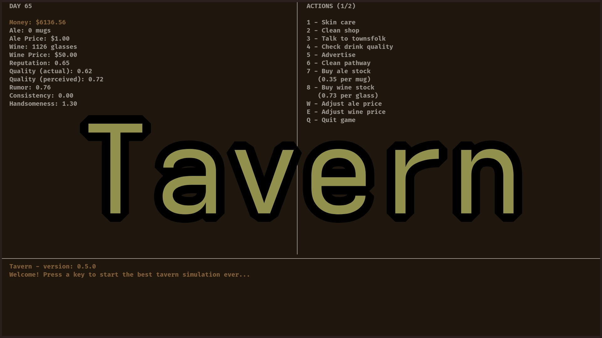

# Tavern

## Tavern is a tavern simulator written in C and uses ncurses.

	

It Features:

- Rent
- Stock management
- Price management
- Reputation management
- Quality management
- Ale and Wine
- Rumors
- Consistency 
- Handsomeness (affects reputation)
- Supplier and supplier price instability
- Awesome ncurses UI
- Dirty pathways (causes customers to fall, you have to clean it!)

Here's a to-do list for this game:

- Inflation
- Customers doing weird stuff that you have to take care of
- Bad things happening to your stocks, like thieves stealing them
- Changes in population, so the potential customer number is not stable.
- *and much more stuff that could happen in an actual medieval tavern...*

## Build
### Needs:
- GNU Make
- gcc
- ncurses

run `make` in root directory of the project (where Makefile is located)
