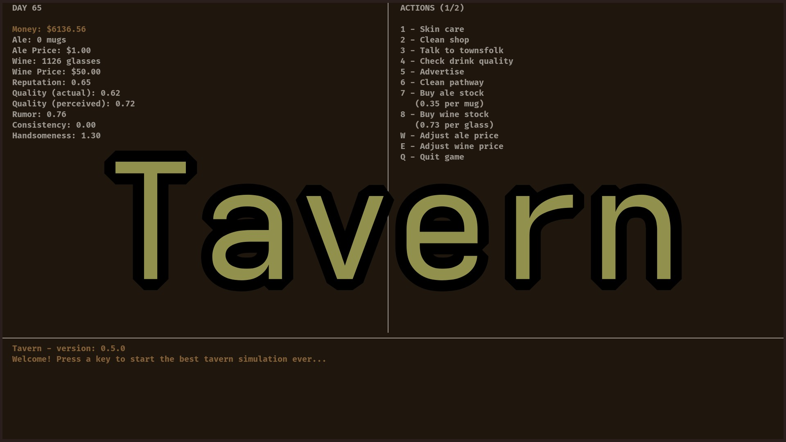

# Tavern

## Tavern is a tavern simulator written in C and uses ncurses.

	

It Features:

- Rent
- Stock management
- Price management
- Reputation management
- Quality management
- Ale and Wine
- Rumors
- Consistency 
- Handsomeness (affects reputation)
- Supplier and supplier price instability
- Awesome ncurses UI
- Dirty pathways (causes customers to fall, you have to clean it!)
- Wars. Your kingdom can declare war at other kingdoms, and the opposite too
- Inflation
- Customers doing weird stuff that you have to take care of
- Bad things happening to your stocks, like thieves stealing them
- Changes in population, so the potential customer number is not stable
- Winery. You can make your own wine with fruits
- A top-down 2D mini-game where you collect fruits for making wine
- Employees. You can hire them to increase available actions per day
- Expanding the tavern. You can only hire limited amount of employees per tavern "size"
- Different kinds of wine (apple and grape)
- Patrons have anger
- Cats!

Here's a to-do list for this game (The ones with strikethrough are done):

- ~~Port code to c89~~
- *and much more stuff that could happen in an actual medieval tavern...*

## itch.io
Please comment on the [itch.io page](https://terra2o.itch.io/tavern)! You can also get pre-built binaries there for macOS, Linux, and Windows.

## Human made!
This project is made by a human and contributors must be human as well! LLM usage is minimal.

## Build
### For building on older systems, check out [COMPILING.md](./COMPILING.md).
### Needs:
- GNU Make
- gcc
- ncurses/PDcurses

run `make release` in root directory of the project (where Makefile is located)
